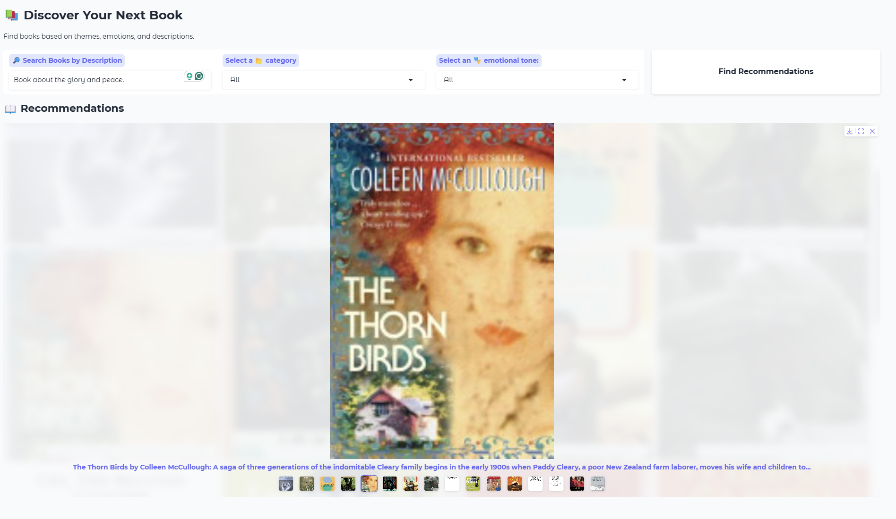
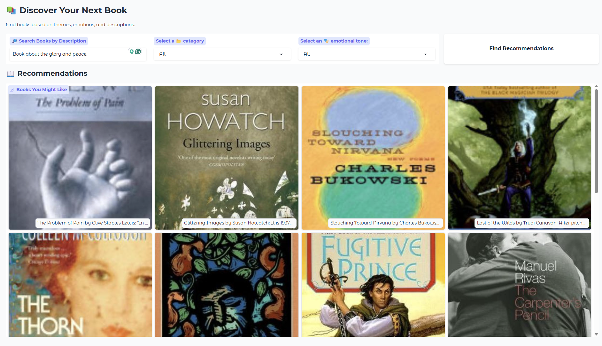

# Next Read Recommender

Next Read Recommender is a Python application that helps users find books tailored to their interests. By providing a short description, users receive personalized book recommendations based on semantic similarity, genre classification, and emotional tone analysis. The system leverages natural language processing (NLP) techniques, including vector search, zero-shot classification, and sentiment analysis, to enhance book discovery. 






## Installation Guide

### 1. Clone the Repository
```shell
git clone https://github.com/diwashrestha/Next_Read_Recommendation.git
cd Next_Read_Recommendation
```

### 2. Set Up a Virtual Environment
It is recommended to install dependencies within a virtual environment.
```shell
python -m venv nextread-venv
source nextread-venv/bin/activate  # On Windows: nextread-venv\Scripts\activate
python -m pip install --upgrade pip
```

### 3. Install Required Dependencies
```shell
pip install -r requirements.txt
```

### 4. Set Up Environment Variables
Create a `.env` configuration file and add the following API keys:
```shell
# Gemini API Key
GEMINI_API_KEY=

# Hugging Face API Token
HUGGINGFACE_API_TOKEN=
```

---

## API Keys
The application requires API keys for text classification and processing:
- **Gemini API Key** 
- **Hugging Face API Token**

Store API keys securely and update the `.env` file accordingly.


## Running the Web Application

Once dependencies are installed and API keys are set up, you can start the Gradio web application:

```shell
python gradio-dashboard.py
```
This will launch a local web interface where you can input a book description and receive recommendations.
